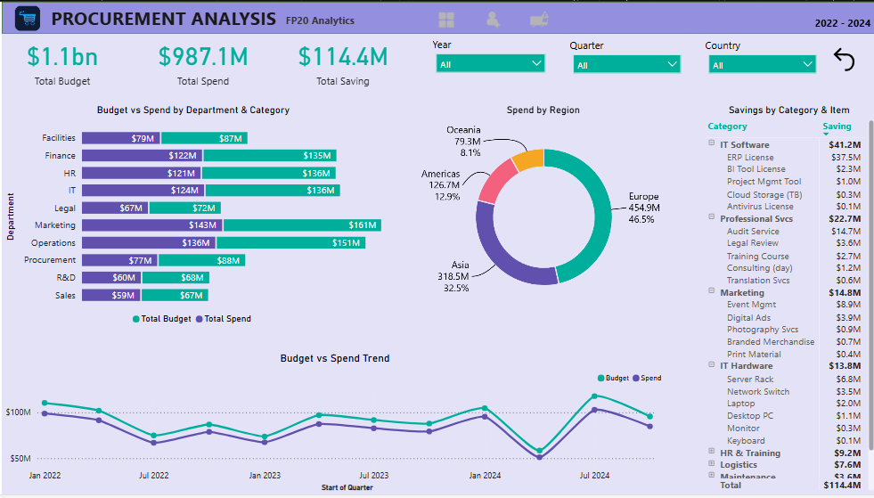
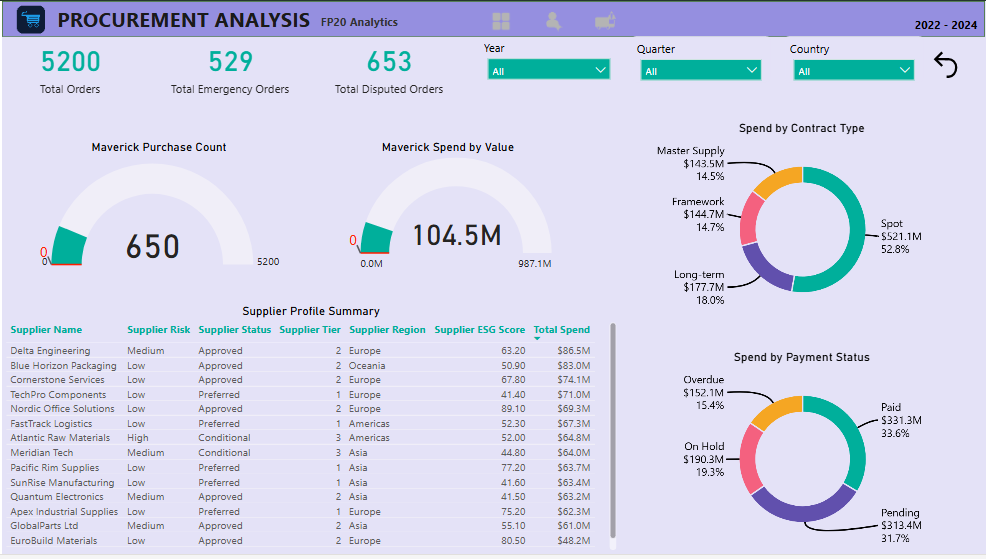
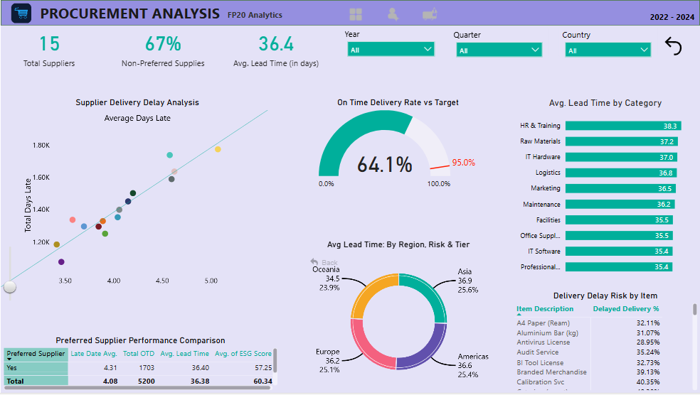

# Procurement Intelligence Power BI Dashboard

## Project Overview
Analysis of 5,200 procurement records spanning 2022–2024, covering purchase orders, supplier performance, delivery metrics, budget utilisation, and compliance risk across 10 departments, 10 categories, and 4 global regions.

All multi-currency transactions (GBP, EUR, JPY, AUD) were converted to USD using year-specific exchange rates for accurate cross-currency comparison, ensuring apples-to-apples analysis across regions.

---

## Key Findings

**Budget & Spend**
Total spend of $987.1M against a $1.1bn approved budget, achieving $114.4M in savings, a 10.3% savings rate across all categories. IT Software alone contributed $41.2M in savings.

**Supplier Performance**
Only 64.1% of orders were delivered on time against a 95% target, a 30.9 percentage point gap signalling significant supply chain risk. Average lead time across all categories stands at 36.4 days, with HR & Training highest at 38.3 days.

**Maverick Spend**
10.2% of all purchase orders (529 POs) were raised as Emergency POs, and 67% of spend flows through non-preferred suppliers, both indicators of poor procurement planning and contract compliance.

**Delivery Risk**
Scatter analysis reveals chronic late delivery concentrated in specific suppliers, with Calibration Services showing a 40.35% delayed delivery rate, the highest in the dataset.

---

## Tools Used
- Power BI Desktop
- DAX (currency conversion, KPI measures, compliance metrics)
- ZoomCharts Visuals
- Excel / Python (data exploration)

---

## Dashboard Features
- Multi-currency conversion to USD via DAX SWITCH measures
- Interactive Year, Quarter, and Country slicers
- Budget vs Actual Spend trend across 12 quarters
- Supplier delivery delay scatter analysis
- On-Time Delivery Rate gauge vs 95% target
- Average Lead Time breakdown by category and region
- Preferred vs Non-Preferred supplier comparison
- Maverick & Emergency PO risk tracking
- Savings breakdown by category and item

---

## Dashboard Preview

---

## Data Source
FP20 Analytics · ZoomCharts Challenge 37
Dataset: 5,200 procurement records · 2022-2024 · Multi-currency

---

## Author
[LinkedIn Profile] https://www.linkedin.com/in/mohammad-amir-b93a26397/

---

## Participation
This project was submitted as part of the **FP20 Analytics ZoomCharts Challenge 37**.

\#FP20Analytics \#builtwithzoomcharts
